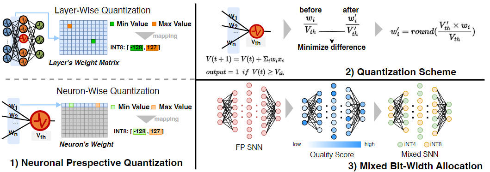

# NeuronQuant: Accurate and Efficient Post-Training Quantization for Spiking Neural Networks

**[Haomin Li](https://shieldforever.github.io/)\*, [Fangxin Liu](https://mxhx7199.github.io/)\*, Zewen Sun, [Zongwu Wang](https://zongwuwang.github.io/), Shiyuan Huang, Ning Yang, [Li Jiang](https://cs.sjtu.edu.cn/~jiangli/)**

> **This is the official implementation of the paper "NeuronQuant: Accurate and Efficient Post-Training Quantization for Spiking Neural Networks"  [ASP-DAC 2025]**

## Introduction



### Prepare Models and Running Quantization

```shell
./run.sh
```

## Citation

```latex
@inproceedings{li2025neuronquant,
  title={NeuronQuant: Accurate and Efficient Post-Training Quantization for Spiking Neural Networks},
  author={Li, Haomin and Liu, Fangxin and Sun, Zewen and Wang, Zongwu and Huang, Shiyuan and Yang, Ning and Jiang, Li},
  booktitle={2025 30th Asia and South Pacific Design Automation Conference (ASP-DAC)},
  year={2025}
}
```

## Acknowledgement

Our Code is based on the implementation of [ANN2SNN_SRP](https://github.com/hzc1208/ANN2SNN_SRP).

## Contact Us

If you have any questions, please contact:

- Haomin Li: haominli@sjtu.edu.cn
- Fangxin Liu: liufangxin@sjtu.edu.cn
- Zewen Sun: 3022244294@tju.edu.cn
- Li Jiang: ljiang_cs@sjtu.edu.cn

